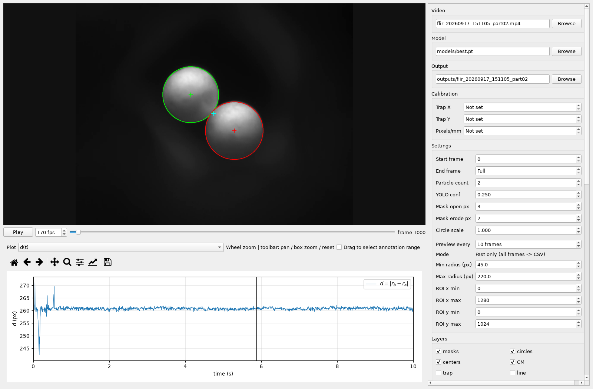
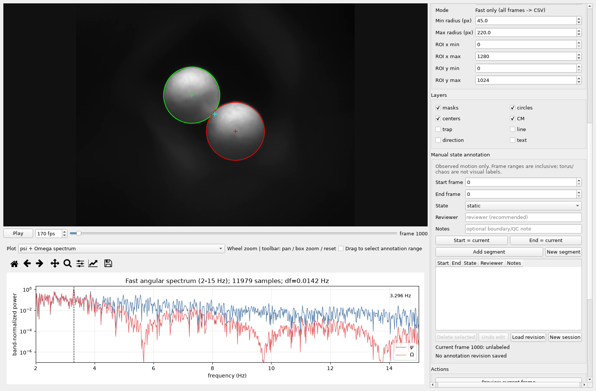

# Tinylev Tracker v0.5

NYU CSMR Grier Lab

Desktop particle tracking with YOLO segmentation, synchronized video and plots,
interactive spectra, and revisioned manual motion-state annotations.



*Actual application screenshot viewing `flir_20260917_151105_part02.mp4`, frame
1000, with its existing tracking CSV. The separation plot is zoomed to 0–10 s.
Calibration remains unset; the view uses pixel measurements. Full workstation
paths are hidden. Raw video and CSV files are not uploaded.*

## Install and run

Use Python 3.12 on Windows. From the repository directory:

```powershell
py -3.12 -m venv .venv
.\.venv\Scripts\python.exe -m pip install -r requirements.txt
.\.venv\Scripts\python.exe run_tracker.py
```

After setup, double-click **`run_tracker.bat`**. The existing
`run_particle_tracking_app.py` entry point starts the same application.
PyTorch is installed by Ultralytics; choose a compatible PyTorch build for GPU use.

The existing trained model is included at `models/best.pt` (unchanged).
SHA-256: `28e233fec3cd9f420ed8268b87a9d236a654e2355a034322005f6822788a233d`.

## Tracking workflow

1. Select an AVI, MP4, MOV or MKV video and the model.
2. Enter measured **Trap X, Trap Y and Pixels/mm**, or load the matching config.
3. Check the radius range and ROI, then preview detections.
4. Run tracking; stop the batch when needed. Load an existing CSV for review.
5. Play or seek the video, inspect synchronized plots, and mark motion intervals.

Fast tracking processes every selected frame and saves a complete `tracking.csv`
and the exact `config.json`. The preview interval only reduces GUI refreshes;
it does not skip inference frames. Annotated-video and debug-frame export are
disabled. An occupied tracking output folder automatically gets a new numbered
sibling, preserving earlier runs. Keep outputs separate from source data.

Default detection filters cover the full video frame and radii of 45–220 px.
These are editable pixel filters, not physical bead-size measurements.

### Explicit calibration

Trap X, Trap Y and Pixels/mm start as **Not set** and serialize as JSON `null`.
Preview inference and tracking require finite center coordinates and a positive
scale. An explicitly entered zero center coordinate is valid. Selecting a
different video clears previous calibration; load or enter the matching values.
Older configs keep their explicit values, so verify their experimental provenance.

This interface accepts calibration values but does not run image-based
trap-center calibration. Existing CSVs can be viewed and annotated without
inventing missing calibration. Center-relative plots require the corresponding
columns; time/frequency units depend on the recording FPS.

## Plots and spectra

| View | Meaning |
|---|---|
| `d(t)` | Small-to-large center separation, px |
| `psi(t)` | Unwrapped small-to-large pair-axis angle, rad |
| `phi(t)` | Wrapped inclination `psi - theta`, rad; theta is CM angle about the configured center |
| `Omega(t)` | Local-linear derivative of psi, rad/s, using a 0.25 s window |
| `d spectrum`, `phi spectrum` | Peak-normalized spectral display |
| `psi + Omega spectrum` | Combined angular spectra over 2–15 Hz |
| `CM trap distance`, `Confidence` | Tracking quality-control views |

Spectra use the longest continuous valid segment, linear detrending and a Hann
window. They do not bridge missing frames. The combined spectrum normalizes each
signal within its displayed band and marks an empirical psi peak. It is not an
automatic identification of a physical state. Plot calculations stay in memory
and do not alter the tracking CSV.

Use the mouse wheel to zoom at the pointer, or the toolbar for pan, box zoom,
view history and reset.

## Manual state annotations



*The same recording, showing the app's angular spectrum and manual annotation
controls. No motion-state labels have been assigned for this screenshot.*

Load the video and, when available, its config and tracking CSV before saving
annotations so their paths and SHA-256 hashes are captured in the manifest.
Set bounds with **Start = current / End = current**, or enable dragging across
a time-series plot. Choose a state and add a reviewer and notes, then **Add segment**.

- `Alt+I` / `Alt+O`: set start / end frame.
- `Ctrl+Enter`: add or update a segment.
- Select a row to edit or delete; double-click to seek to its start.
- **Undo edit** saves restoration as a new revision; **Load revision** resumes work.

Labels include static, jiggling/libration, spinning CW/CCW, rotation with
unspecified direction, spinning candidate, irregular candidate, transition,
and invalid/ambiguous. CW/CCW follow the small-to-large axis in Cartesian y-up
coordinates. Torus and chaos are not visual labels.

Frame bounds are zero-based and inclusive. Overlaps are rejected; gaps stay
unlabeled. Each edit creates a full CSV snapshot and a provenance manifest under
`outputs/manual_state_annotations/<video_id>/<session_timestamp>/`.
Prior revisions, source videos and tracking CSVs are preserved. Do not concatenate
revisions: each is a complete snapshot. The older manager annotation CSV format
can be imported with conservative label mapping.

## Repository layout

```text
run_tracker.py / run_tracker.bat      current application
tinylev_tracker/                      tracking UI, plots and manual annotations
analysis/particle_tracking_app_v0_1/  matching backend and base widgets
models/best.pt                       trained model
tests/                               synthetic regression tests
outputs/                             local derived runs (ignored)
```

The current application is the tracking-focused version. Experiment Manager,
the experiment tree, and Phase A–D are not part of this distribution.

The original repository's `particle_tracking_app/` is retained for compatibility
with `python run_legacy_tracking.py`; see [legacy documentation](docs/legacy-v0.1.md).
It keeps its historical defaults. The current tracker uses its matching backend,
with radius-ordered raw particle selection; the legacy core uses position
continuity. Do not assume those CSV identity semantics are interchangeable.
Tracking detections alone do not establish persistent physical identity.

Only the requested screenshots of experimental data are included. Raw videos,
CSV datasets, local catalogs, manuscripts, credentials and virtual environments
are not included. Screenshot provenance is in [docs/preview-provenance.json](docs/preview-provenance.json).

## Validation

```powershell
$env:QT_QPA_PLATFORM = 'offscreen'
.\.venv\Scripts\python.exe -m unittest discover -s tests -v
```

See [validation notes](docs/VALIDATION.md), [changelog](CHANGELOG.md), and
[source manifest](docs/tracker-v0.5-source-manifest.json).
