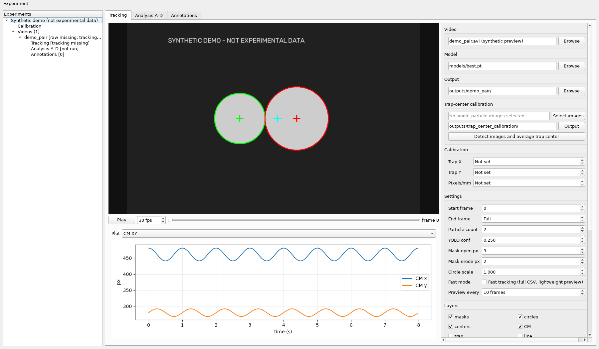

# Tinylev Experiment Manager v0.5

NYU CSMR Grier Lab

Desktop application for YOLO particle tracking, experiment organization,
single-particle trap-center calibration and exploratory trajectory analysis.
This is the full **Experiment Manager v0.5**, not the Light UI.



*Application screenshot with a synthetic demonstration catalog. No experimental
measurements or raw video are shown; calibration starts unset.*

## Install and run (Windows)

Use Python 3.12, from the repository directory:

```powershell
py -3.12 -m venv .venv
.\.venv\Scripts\python.exe -m pip install -r requirements.txt
.\.venv\Scripts\python.exe run_experiment_manager.py
```

After installation, double-click `run_experiment_manager.bat`.
`run_particle_tracking_app.py` starts the same manager. No PowerShell activation
or execution-policy changes are required. PyTorch is installed as an Ultralytics
dependency; select a compatible PyTorch build if GPU acceleration is needed.

The existing `models/best.pt` is reused. SHA-256:
`28e233fec3cd9f420ed8268b87a9d236a654e2355a034322005f6822788a233d`.

## Calibration: no assumed experimental values

**Trap X, Trap Y and Pixels/mm start as `Not set`.** Enter measured values for
this experiment, load its verified config, or use single-particle image
calibration to estimate a center. Preview inference and batch tracking require
finite center coordinates and a positive pixel scale. Unset values serialize
as JSON `null`; an explicitly entered zero center coordinate is valid.
Switching to an experiment without calibration clears the previous values.

Analysis also has no default trap center or center standard errors. Phase A-B
requires explicit center coordinates and x/y standard errors; unknown errors
are not silently replaced with zero. Image-calibration standard errors do not
automatically include bead-to-bead or batch systematic uncertainty.
Enter externally measured x/y standard errors in the experiment record dialog,
or link the corresponding image-calibration output. Leave unknown errors blank.

Loading an older config preserves its explicit numbers. Check its batch and
provenance before use. Detection filters (ROI, radius and confidence) are
software settings in pixels, not physical calibration; inspect each recording.

## Workflow

1. Start with an empty experiment catalog.
2. Add experiments and videos through **Experiment**. The catalog stores
   references and does not move source files.
3. Select the model, supply calibration, check detection settings and preview.
4. Run tracking. Fast mode keeps every selected inference frame and full CSV
   while disabling annotated-video/debug exports. Normal mode supports both.
5. Link tracking and calibration outputs to the experiment. Run Phase A-B.
6. Select intervals for Phase C-D and review labels in the annotation tab.

Tracking writes `tracking.csv` and `config.json`. **Choose a new empty tracking
folder for every run:** the original full-manager writer can replace files in
a reused output folder. Never choose a raw-data folder for output. Calibration
and experiment-analysis outputs use separate versioned directories.

| Phase | Function |
|---|---|
| A | Input existence, schema, frame counts, hashes and provenance |
| B | Identity/QC processing and observational state candidates |
| C | Exploratory phase-locked orbit-center fit |
| D | Temporal half holdouts and leave-one-complete-cycle-out checks |

Phase D fixes training parameters during validation and excludes invalid gaps.
A fitted center is not an independent trapping-center calibration. Candidate
states and scores do not prove torus, chaos or a theoretical limit-cycle radius.
Cross-burst and independent static/slow validation remain outside Phase D core.

## Layout

```text
run_experiment_manager.py             current full application
analysis/particle_tracking_app_v0_1/  v0.5 manager and matching tracking core
analysis/dynamic_pair_analysis/       analysis dependencies
models/best.pt                       existing trained model
raw_data/                            optional local videos (ignored)
data/experiment_catalog.json         local catalog (created on save; ignored)
outputs/                             derived runs (ignored)
```

The `v0_1` directory name is retained for import compatibility; its manager is
v0.5. No experimental datasets, local catalogs, notebooks, manuscripts,
credentials or virtual environments are included.

## Legacy version and CSV compatibility

The prior root `particle_tracking_app/` is preserved and runs with
`python run_legacy_tracking.py`. Its documentation is saved in
[docs/legacy-v0.1.md](docs/legacy-v0.1.md). It retains historical behavior and
defaults; use the manager entry point for the new unset calibration defaults.

The cores have different identity and CSV behavior. The legacy repository core
keeps persistent particle identities by position continuity. The manager's raw
two-particle selection is radius ordered; its separate analysis pipeline
performs continuity/QC cleanup. Radius order is not guaranteed physical identity.
Inspect schemas before combining outputs from different versions.

## Tests

Synthetic tests require no experimental videos or network access:

```powershell
$env:QT_QPA_PLATFORM = 'offscreen'
.\.venv\Scripts\python.exe -m unittest discover -s analysis/particle_tracking_app_v0_1/tests -v
.\.venv\Scripts\python.exe -m unittest discover -s analysis/dynamic_pair_analysis/tests -v
```

Windows CI runs the same suites. See [docs/VALIDATION.md](docs/VALIDATION.md),
[CHANGELOG.md](CHANGELOG.md) and the source hash manifest in `docs/`.
